# PERFORM: In-House Goal Setting & Tracking Portal

A comprehensive web-based application for organizational goal management, performance tracking, and quarterly check-ins. Built with Next.js, TypeScript, and Supabase.

## System Architecture

```mermaid
flowchart TB
    %% ==================== STYLING ====================
    classDef user fill:#e3f2fd,stroke:#1565c0,stroke-width:2px
    classDef frontend fill:#fff3e0,stroke:#e65100,stroke-width:2px
    classDef backend fill:#e8f5e9,stroke:#2e7d32,stroke-width:2px
    classDef database fill:#fce4ec,stroke:#c62828,stroke-width:2px
    classDef external fill:#f3e5f5,stroke:#6a1b9a,stroke-width:2px

    %% ==================== USER PERSONAS ====================
    subgraph USER_LAYER ["User Personas"]
        direction LR
        EMP["👤 Employee"]:::user
        MGR["👨‍💼 L1 Manager"]:::user
        ADMIN["🛡️ Admin/HR"]:::user
    end

    %% ==================== PRESENTATION LAYER ====================
    subgraph FRONTEND ["Presentation Layer (Vercel)"]
        direction TB
        NEXT["Next.js 16.2.6 / React 19"]:::frontend
        TAILWIND["Tailwind CSS 4"]:::frontend

        subgraph DASHBOARDS ["Router Dashboards (RBAC)"]
            direction LR
            EMP_DASH["Employee Workspace<br/>src/app/dashboard/workspace"]:::frontend
            MGR_DASH["Manager Review Board<br/>src/app/dashboard/review"]:::frontend
            ADMIN_DASH["Admin/HR Command Portal<br/>src/app/dashboard/admin"]:::frontend
        end

        NOTIF["Notification Bell<br/>Components"]:::frontend
        NEXT --> DASHBOARDS
        NEXT --> NOTIF
    end

    %% ==================== APPLICATION LAYER ====================
    subgraph BACKEND ["Application Layer (Next.js Server Actions)"]
        direction TB

        subgraph CONTROLLERS ["Business Logic Controllers"]
            direction LR
            AUTH_RBAC["Auth & RBAC Interceptor<br/>middleware.ts + login/actions.ts<br/>JWT + Supabase Session"]:::backend
            GOAL_ENGINE["Goal Lifecycle Engine<br/>goal-sheet.actions.ts<br/>Weightage = 100%<br/>Min Goal >= 10%<br/>Max Goals = 8<br/>State Lock on Approval"]:::backend
            FORMULA_EVAL["UoM Performance Formula<br/>goal.actions.ts<br/>Min / Max / Timeline<br/>Zero-based Metrics"]:::backend
            SYNC_ENGINE["Shared Goals Sync<br/>admin.actions.ts:distributeKPI<br/>Dept KPIs -> Employee Sheets"]:::backend
        end

        subgraph ACTIONS ["Server Actions"]
            direction LR
            PROFILE["profile.actions.ts"]:::backend
            SHEET["goal-sheet.actions.ts"]:::backend
            GOAL["goal.actions.ts"]:::backend
            ADMIN["admin.actions.ts"]:::backend
            NOTIF["notification.actions.ts"]:::backend
        end
    end

    %% ==================== DATA & STORAGE LAYER ====================
    subgraph DATA ["Data & Storage Layer (Supabase PostgreSQL)"]
        direction TB

        subgraph TABLES ["Database Tables"]
            direction LR
            PROFILES["profiles<br/>User + Role + manager_id"]:::database
            CYCLES["performance_cycles<br/>Q1-Q4 Windows"]:::database
            SHEETS["goal_sheets<br/>Status: draft/submitted/locked"]:::database
            GOALS["goals<br/>Weightage + UoM + Progress"]:::database
            CHECKINS["checkin_comments<br/>Quarterly Feedback"]:::database
            AUDIT["audit_logs<br/>Immutable Change Log"]:::database
            NOTIFICATIONS["notifications<br/>In-App Alerts"]:::database
        end

        RLS["Row Level Security<br/>Policies"]:::database
    end

    %% ==================== EXTERNAL SERVICES ====================
    subgraph EXTERNAL ["External Services & Integrations"]
        direction TB
        SMTP["SMTP Email Service<br/>Supabase Auth Emails"]:::external
        WEBHOOK["Webhook Notifications<br/>Future: Teams/Slack"]:::external
        CRON["Cron Escalation Worker<br/>Future: Missed Check-in Alerts"]:::external
    end

    %% ==================== DATA FLOW CONNECTIONS ====================

    %% User to Frontend
    EMP -->|"HTTPS"| EMP_DASH
    MGR -->|"HTTPS"| MGR_DASH
    ADMIN -->|"HTTPS"| ADMIN_DASH

    %% Frontend to Backend
    EMP_DASH -->|"Server Actions + JWT"| CONTROLLERS
    MGR_DASH -->|"Server Actions + JWT"| CONTROLLERS
    ADMIN_DASH -->|"Server Actions + JWT"| CONTROLLERS
    NOTIF -->|"Polling/Fetch"| NOTIF

    %% Backend Actions to Controllers
    SHEET -->|"SQL"| GOAL_ENGINE
    GOAL -->|"SQL"| FORMULA_EVAL
    ADMIN -->|"SQL"| SYNC_ENGINE

    %% Controllers to Data Layer
    AUTH_RBAC -->|"SQL + RLS"| PROFILES
    GOAL_ENGINE -->|"SQL"| SHEETS
    GOAL_ENGINE -->|"SQL: Lock state"| SHEETS
    GOAL_ENGINE -->|"SQL: Validate weight"| GOALS
    GOAL_ENGINE -->|"SQL: Audit trail"| AUDIT
    FORMULA_EVAL -->|"SQL: Progress calc"| GOALS
    SYNC_ENGINE -->|"SQL: Cascade"| GOALS

    %% Notification Flow
    GOAL_ENGINE -->|"Server Action"| NOTIF
    NOTIF -->|"SQL INSERT"| NOTIFICATIONS
    NOTIFICATIONS -->|"SMTP Trigger"| SMTP
    NOTIFICATIONS -->|"Webhook URL"| WEBHOOK

    %% External Services
    PROFILES -->|"SMTP"| SMTP
    CRON -->|"Cron SQL Query"| PROFILES

    linkStyle default stroke:#333,stroke-width:1.5px
```



---

## Technology Stack

| Layer          | Technology                                    |
| -------------- | -------------------------------------------- |
| Framework      | Next.js 16.2.6 (App Router)                  |
| UI             | React 19.2.4, Tailwind CSS 4                 |
| Language       | TypeScript 5                                  |
| Auth/DB        | @supabase/ssr, @supabase/supabase-js         |
| Animations     | GSAP 3.15                                    |
| Database       | Supabase (PostgreSQL)                        |
| Deployment     | Vercel                                       |

---

## User Roles & Permissions

### Employee
- Create and manage personal goals
- Track progress on assigned goals
- View departmental KPIs shared by manager
- Submit quarterly check-ins

### L1 Manager
- View and approve team goal sheets
- Cascade departmental KPIs to direct reports
- Review and acknowledge quarterly check-ins
- Access team performance analytics

### Admin / HR
- Manage user profiles and reporting hierarchy
- Configure system-wide goal settings
- Configure performance cycles (Q1-Q4)
- Manage thrust areas and KPIs
- Unlock locked goal sheets
- Access organizational analytics
- Audit all system changes

---

## Core Features

### Goal Lifecycle Engine
- Validates total weightage equals 100%
- Enforces minimum 10% weight per goal
- Restricts maximum of 8 goals per employee
- Implements state lock upon manager approval

### Performance Formula Evaluator (UoM Types)
- **numeric_min**: Progress capped at defined floor
- **percentage_min**: Percentage progress with floor
- **numeric_max**: Progress capped at defined ceiling
- **percentage_max**: Percentage progress with ceiling
- **timeline**: Progress based on elapsed time vs target
- **zero_based**: Progress starts from baseline

### Shared Goals Sync
- Cascades departmental KPIs to multiple employee sheets
- Maintains read-only status for title and target fields
- Syncs automatically on manager approval

### Audit Logging
- Immutable log of all post-lock modifications
- Records: Who, What (field), When, Old/New values
- Triggered on any goal sheet change after approval lock

### Notification System
- In-app notifications with real-time updates
- Notification bell component with unread counts
- Deep-links to target pages

---

## Getting Started

### Prerequisites
- Node.js 18+
- pnpm (or npm/yarn)
- Supabase account

### Installation
```bash
# Install dependencies
pnpm install

# Set up environment variables
cp .env.example .env.local

# Run development server
pnpm dev
```

---

## Database Schema

### Tables

| Table | Description |
| ----- |-------------|
| **profiles** | User info, role, reporting hierarchy (manager_id) |
| **performance_cycles** | Q1-Q4 goal setting and review windows |
| **goal_sheets** | Employee goal collections with status (draft/submitted/locked) |
| **goals** | Individual goals with weightage, UoM, progress tracking |
| **checkin_comments** | Manager feedback on quarterly check-ins |
| **audit_logs** | Immutable record of post-lock modifications |
| **notifications** | In-app alert system |

---

## Key Files

| Path | Purpose |
|------|---------|
| `src/middleware.ts` | Auth redirects & RBAC path protection |
| `src/lib/actions/*.ts` | Server actions for all CRUD operations |
| `src/app/dashboard/page.tsx` | Role-based dashboard router |
| `src/app/dashboard/workspace/*` | Employee goal management |
| `src/app/dashboard/review/*` | Manager approval workflow |
| `src/app/dashboard/admin/*` | Admin/HR command portal |

---

## License

MIT